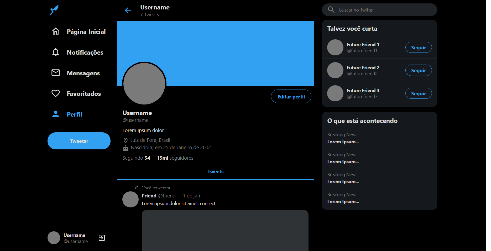

<h1 align="center">
    <b>:rocket:Twitter!:rocket:</b> 
</h1>

<p align="center">
  <a href="https://rocketseat.com.br">
    
  </a>
  <a>
  
  

</p>


## :bookmark: Sobre

Cópia realizada na série UI Clone no canal da RockeatSeat no Youtube.

<a id="documentacao"></a>

## :rocket: Tecnologias Utilizadas

O projeto foi desenvolvido utilizando as seguintes tecnologias

- [TypeScript](https://www.typescriptlang.org/)
- [ReactJS](https://reactjs.org/)

## :heavy_check_mark: Inteface:

<h1 align="center">
    
</h1>

<a id="como-usar"></a>

## :fire: Como usar

- ### **Pré-requisitos**

  - É **necessário** possuir o **[Node.js](https://nodejs.org/en/)** no mínimo na versão 12.0 instalado na máquina
  - Também, é **preciso** ter um gerenciador de pacotes seja o **[NPM](https://www.npmjs.com/)** ou **[Yarn](https://yarnpkg.com/)**.

1. Faça um clone :

```sh
  $ git clone https://github.com/CharlesLB/cloning-pages-react.git
```

2. Para executar:

```
  # Instale as dependências
  $ npm install

  # Inicie a aplicação web
  $ yarn start

```

<a id="como-contribuir"></a>

## :recycle: Como contribuir

- Faça um Fork desse repositório,
- Crie uma branch com a sua feature: `git checkout -b my-feature`
- Commit suas mudanças: `git commit -m 'feat: My new feature'`
- Push a sua branch: `git push origin my-feature`

## :memo: License

Esse projeto está sob a licença MIT. Veja o arquivo [LICENSE](LICENSE.md) para mais detalhes.
