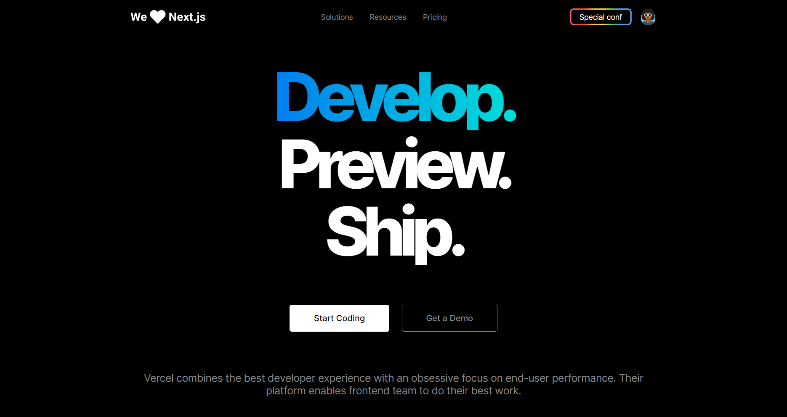

<h1 align="center">
    <b>:computer:Vercel!:computer:</b>
</h1>

## :bookmark: Sobre

Cópia realizada na série UI Clone no canal da RockeatSeat no Youtube  [(Video)](https://www.youtube.com/watch?v=204ewU7NRO0&t=51s).

## :rocket: Tecnologias Utilizadas

O projeto foi desenvolvido utilizando as seguintes tecnologias

O projeto foi desenvolvido utilizando as seguintes tecnologias

- [SASS](https://www.typescriptlang.org/)
- [JavaScript](https://reactjs.org/)

## :heavy_check_mark: Inteface:

<h1 align="center">
    
</h1>

## :recycle: Como contribuir

- Faça um Fork desse repositório,
- Crie uma branch com a sua feature: `git checkout -b my-feature`
- Commit suas mudanças: `git commit -m 'feat: My new feature'`
- Push a sua branch: `git push origin my-feature`

## :memo: License

Esse projeto está sob a licença MIT. Veja o arquivo [LICENSE](LICENSE.md) para mais detalhes.
